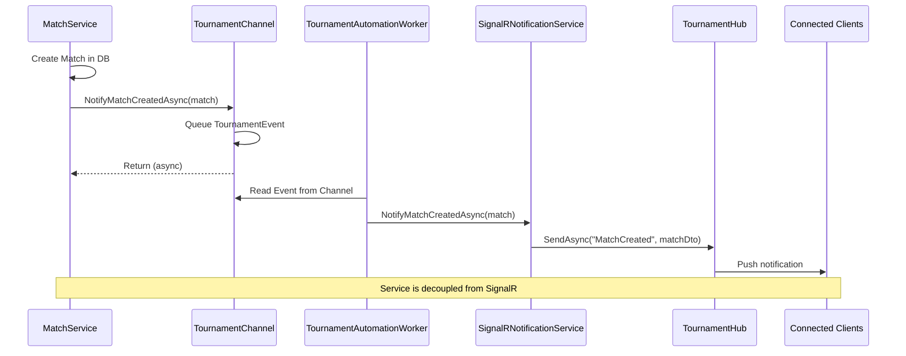

# SignalR Notification Service to Event-Driven Architecture Refactor

## Overview

This plan outlines the refactoring of the SignalR notification system from a direct service-call model to an event-driven architecture. All methods currently in [`ISignalRNotificationService`](../src/VolleyballRallyManager.Lib/Services/ISignalRNotificationService.cs) and [`SignalRNotificationService`](../src/VolleyballRallyManager.Lib/Services/SignalRNotificationService.cs) will be moved to use the [`TournamentChannel`](../src/VolleyballRallyManager.Lib/Workers/TournamentChannel.cs) event system, with [`TournamentAutomationWorker`](../src/VolleyballRallyManager.Lib/Workers/TournamentAutomationWorker.cs) handling the actual SignalR broadcasting.

## Current Architecture Issues

1. **Tight Coupling**: Services like [`MatchService`](../src/VolleyballRallyManager.Lib/Services/MatchService.cs) and [`AnnouncementService`](../src/VolleyballRallyManager.Lib/Services/AnnouncementService.cs) are tightly coupled to [`ISignalRNotificationService`](../src/VolleyballRallyManager.Lib/Services/ISignalRNotificationService.cs)
2. **Direct Dependencies**: Services directly depend on SignalR hub contexts through the notification service
3. **Inconsistent Pattern**: Some events already use the channel pattern (via `ScoringChannel`), while notifications use direct service calls
4. **Difficult Testing**: Direct SignalR dependencies make unit testing more complex

## Proposed Architecture

### Event-Driven Flow
```
Service → TournamentChannel (Raise Event) → TournamentAutomationWorker (Handle Event) → SignalRNotificationService (Broadcast)
```

### Benefits
- **Decoupling**: Services only depend on the channel, not SignalR
- **Consistency**: All tournament events use the same pattern
- **Testability**: Easier to mock and test
- **Reliability**: Queued events with bounded channel support
- **Observability**: Centralized event logging

## Implementation Plan

### 1. Analysis Phase

#### Current SignalR Notification Methods (21 methods)

From [`ISignalRNotificationService`](../src/VolleyballRallyManager.Lib/Services/ISignalRNotificationService.cs:10):

**Match Notifications:**
1. `NotifyMatchCreatedAsync(Match match)` - Line 16
2. `NotifyMatchUpdatedAsync(Match match)` - Line 22
3. `NotifyMatchStartedAsync(Match match)` - Line 28
4. `NotifyMatchFinishedAsync(Match match)` - Line 34
5. `NotifyMatchDisputedAsync(Match match)` - Line 40
6. `NotifyScoreUpdateAsync(Match match)` - Line 47

**Bulletin Notifications:**
7. `NotifyBulletinCreatedAsync(Bulletin bulletin)` - Line 53
8. `NotifyBulletinUpdatedAsync(Bulletin bulletin)` - Line 59
9. `NotifyBulletinDeletedAsync(Guid bulletinId)` - Line 65

**Team Notifications:**
10. `NotifyTeamCreatedAsync(Team team)` - Line 71
11. `NotifyTeamUpdatedAsync(Team team)` - Line 77
12. `NotifyTeamDeletedAsync(Guid teamId)` - Line 83

**General Notifications:**
13. `NotifyTournamentStatusAsync(string status)` - Line 89
14. `NotifyErrorAsync(string error)` - Line 95
15. `BroadcastMessageAsync(string message, string type)` - Line 102

**Feed Notifications:**
16. `NotifyAddFeedAsync(MatchUpdate update)` - Line 109

**Announcement Notifications:**
17. `NotifyAnnouncementCreatedAsync(Announcement announcement)` - Line 115
18. `NotifyAnnouncementUpdatedAsync(Announcement announcement)` - Line 121
19. `NotifyAnnouncementDeletedAsync(Guid announcementId)` - Line 127
20. `NotifyAnnouncementPropertyChangedAsync(Guid announcementId, string property, string value)` - Line 136
21. `NotifyAnnouncementQueueChangedAsync(List<Announcement> announcements)` - Line 143
22. `NotifyAnnouncementCalledAsync(Announcement announcement)` - Line 150

#### Services Using ISignalRNotificationService

1. **[`MatchService`](../src/VolleyballRallyManager.Lib/Services/MatchService.cs:14)** - Uses notification service for match-related updates
2. **[`AnnouncementService`](../src/VolleyballRallyManager.Lib/Services/AnnouncementService.cs:17)** - Uses notification service for announcement updates
3. **[`TournamentAutomationWorker`](../src/VolleyballRallyManager.Lib/Workers/TournamentAutomationWorker.cs:69)** - Has commented code that uses notification service
4. **[`ScoringAutomationWorker`](../src/VolleyballRallyManager.Lib/Workers/ScoringAutomationWorker.cs:68)** - Currently uses notification service

### 2. Define New Event Types

Update [`TournamentEventType`](../src/VolleyballRallyManager.Lib/Common/TournamentEventType.cs:6) enum to include:

```csharp
public enum TournamentEventType
{
    // Existing events
    CallToCourt,
    CallToSupport,
    MatchStart,
    MatchSetStart,
    MatchSetEnd,
    MatchSetRevertToPrevious,
    MatchSetScoreChange,
    MatchEnd,
    MatchDisputed,
    UpdateDivisionRanks,
    
    // New notification events
    MatchCreated,
    MatchUpdated,
    MatchStarted,
    MatchFinished,
    MatchDisputedNotification,
    ScoreUpdate,
    
    BulletinCreated,
    BulletinUpdated,
    BulletinDeleted,
    
    TeamCreated,
    TeamUpdated,
    TeamDeleted,
    
    TournamentStatus,
    ErrorNotification,
    BroadcastMessage,
    
    AddFeed,
    
    AnnouncementCreated,
    AnnouncementUpdated,
    AnnouncementDeleted,
    AnnouncementPropertyChanged,
    AnnouncementQueueChanged,
    AnnouncementCalled
}
```

### 3. Update TournamentEvent Model

Update [`TournamentEvent`](../src/VolleyballRallyManager.Lib/Common/TournamentEvent.cs:6) to support notification data:

```csharp
public class TournamentEvent
{
    public TournamentEventType EventType { get; set; }
    public Guid TournamentId { get; set; }
    public Guid? MatchId { get; set; }        // Add this
    public Guid? TeamId { get; set; }
    public Guid? DivisionId { get; set; }
    public Guid? RoundId { get; set; }
    public Guid? TournamentRoundId { get; set; }
    public Guid? EntityId { get; set; }       // Add for generic entity references (bulletin, announcement IDs)
    
    // For passing complex objects through events
    public Match? Match { get; set; }                        // Add this
    public Bulletin? Bulletin { get; set; }                  // Add this
    public Team? Team { get; set; }                          // Add this
    public Announcement? Announcement { get; set; }          // Add this
    public MatchUpdate? MatchUpdate { get; set; }            // Add this
    public List<Announcement>? Announcements { get; set; }   // Add this
    
    // For simple notifications
    public string? Message { get; set; }      // Add this
    public string? MessageType { get; set; }  // Add this
    public string? Property { get; set; }     // Add this
    public string? Value { get; set; }        // Add this
    
    public Dictionary<string, object>? AdditionalData { get; set; }
    public DateTime Timestamp { get; set; }
    public string Source { get; set; } = "unknown";
    public string UserName { get; set; } = "unknown";
    
    public TournamentEvent()
    {
        Timestamp = DateTime.Now;
    }
}
```

### 4. Create TournamentChannel Methods

Add methods to [`TournamentChannel`](../src/VolleyballRallyManager.Lib/Workers/TournamentChannel.cs:10) for each notification type:

**Match Notification Methods:**
```csharp
public async Task NotifyMatchCreatedAsync(Match match, string source = "system")
public async Task NotifyMatchUpdatedAsync(Match match, string source = "system")
public async Task NotifyMatchStartedAsync(Match match, string source = "system")
public async Task NotifyMatchFinishedAsync(Match match, string source = "system")
public async Task NotifyMatchDisputedAsync(Match match, string source = "system")
public async Task NotifyScoreUpdateAsync(Match match, string source = "system")
```

**Bulletin Notification Methods:**
```csharp
public async Task NotifyBulletinCreatedAsync(Bulletin bulletin, Guid tournamentId, string source = "system")
public async Task NotifyBulletinUpdatedAsync(Bulletin bulletin, Guid tournamentId, string source = "system")
public async Task NotifyBulletinDeletedAsync(Guid bulletinId, Guid tournamentId, string source = "system")
```

**Team Notification Methods:**
```csharp
public async Task NotifyTeamCreatedAsync(Team team, Guid tournamentId, string source = "system")
public async Task NotifyTeamUpdatedAsync(Team team, Guid tournamentId, string source = "system")
public async Task NotifyTeamDeletedAsync(Guid teamId, Guid tournamentId, string source = "system")
```

**General Notification Methods:**
```csharp
public async Task NotifyTournamentStatusAsync(string status, Guid tournamentId, string source = "system")
public async Task NotifyErrorAsync(string error, Guid tournamentId, string source = "system")
public async Task BroadcastMessageAsync(string message, Guid tournamentId, string type = "info", string source = "system")
```

**Feed Notification Methods:**
```csharp
public async Task NotifyAddFeedAsync(MatchUpdate update, Guid tournamentId, string source = "system")
```

**Announcement Notification Methods:**
```csharp
public async Task NotifyAnnouncementCreatedAsync(Announcement announcement, string source = "system")
public async Task NotifyAnnouncementUpdatedAsync(Announcement announcement, string source = "system")
public async Task NotifyAnnouncementDeletedAsync(Guid announcementId, Guid tournamentId, string source = "system")
public async Task NotifyAnnouncementPropertyChangedAsync(Guid announcementId, string property, string value, Guid tournamentId, string source = "system")
public async Task NotifyAnnouncementQueueChangedAsync(List<Announcement> announcements, Guid tournamentId, string source = "system")
public async Task NotifyAnnouncementCalledAsync(Announcement announcement, string source = "system")
```

Implementation pattern for each method:
```csharp
public async Task NotifyMatchCreatedAsync(Match match, string source = "system")
{
    var tournamentEvent = new TournamentEvent
    {
        EventType = TournamentEventType.MatchCreated,
        TournamentId = match.TournamentId,
        MatchId = match.Id,
        Match = match,
        Source = source,
        UserName = source
    };
    await QueueEventAsync(tournamentEvent);
}
```

### 5. Update TournamentAutomationWorker

Add handler methods in [`TournamentAutomationWorker`](../src/VolleyballRallyManager.Lib/Workers/TournamentAutomationWorker.cs:17) for each event type:

**Update ProcessEventAsync switch statement:**
```csharp
private async Task ProcessEventAsync(TournamentEvent tournamentEvent, CancellationToken cancellationToken)
{
    using var scope = _serviceScopeFactory.CreateScope();
    var notificationService = scope.ServiceProvider.GetRequiredService<ISignalRNotificationService>();
    
    switch (tournamentEvent.EventType)
    {
        // Existing handlers
        case TournamentEventType.UpdateDivisionRanks:
            await HandleUpdateDivisionRanks(tournamentEvent, ...);
            break;
            
        // New notification handlers
        case TournamentEventType.MatchCreated:
            await HandleMatchCreated(tournamentEvent, notificationService);
            break;
        case TournamentEventType.MatchUpdated:
            await HandleMatchUpdated(tournamentEvent, notificationService);
            break;
        // ... add cases for all 22 event types
            
        default:
            _logger.LogWarning("Unknown tournament event type: {EventType}", tournamentEvent.EventType);
            break;
    }
}
```

**Handler method pattern:**
```csharp
private async Task HandleMatchCreated(TournamentEvent tournamentEvent, ISignalRNotificationService notificationService)
{
    if (tournamentEvent.Match == null)
    {
        _logger.LogWarning("Match is null for MatchCreated event");
        return;
    }
    
    await notificationService.NotifyMatchCreatedAsync(tournamentEvent.Match);
    _logger.LogInformation("Processed MatchCreated notification for match {MatchId}", tournamentEvent.MatchId);
}
```

### 6. Update Services to Use TournamentChannel

#### Update MatchService

Replace [`ISignalRNotificationService`](../src/VolleyballRallyManager.Lib/Services/MatchService.cs:12) dependency with `TournamentChannel`:

**Before:**
```csharp
public class MatchService : IMatchService
{
    private readonly ApplicationDbContext _context;
    private readonly ISignalRNotificationService _notificationService;
    
    public MatchService(ApplicationDbContext context, ISignalRNotificationService notificationService)
    {
        _context = context;
        _notificationService = notificationService;
    }
    
    // Method using notification service
    public async Task<Match> CreateMatchAsync(Match match)
    {
        _context.Matches.Add(match);
        await _context.SaveChangesAsync();
        await _notificationService.NotifyMatchCreatedAsync(match);
        return match;
    }
}
```

**After:**
```csharp
public class MatchService : IMatchService
{
    private readonly ApplicationDbContext _context;
    private readonly TournamentChannel _tournamentChannel;
    
    public MatchService(ApplicationDbContext context, TournamentChannel tournamentChannel)
    {
        _context = context;
        _tournamentChannel = tournamentChannel;
    }
    
    // Method using tournament channel
    public async Task<Match> CreateMatchAsync(Match match)
    {
        _context.Matches.Add(match);
        await _context.SaveChangesAsync();
        await _tournamentChannel.NotifyMatchCreatedAsync(match);
        return match;
    }
}
```

#### Update AnnouncementService

Replace [`ISignalRNotificationService`](../src/VolleyballRallyManager.Lib/Services/AnnouncementService.cs:11) dependency with `TournamentChannel`:

**Similar pattern** - Replace all calls from:
- `_signalRService.NotifyAnnouncementCreatedAsync()` → `_tournamentChannel.NotifyAnnouncementCreatedAsync()`
- `_signalRService.NotifyAnnouncementUpdatedAsync()` → `_tournamentChannel.NotifyAnnouncementUpdatedAsync()`
- etc.

### 7. Update Dependency Injection

Update [`ServiceCollectionExtensions.cs`](../src/VolleyballRallyManager.Lib/Configuration/ServiceCollectionExtensions.cs:54):

**Current:**
```csharp
services.AddSingleton<ISignalRNotificationService, SignalRNotificationService>();
services.AddSingleton<TournamentChannel>();
services.AddHostedService<TournamentAutomationWorker>();
```

**After:**
```csharp
// Keep SignalRNotificationService but make it internal to worker
services.AddSingleton<ISignalRNotificationService, SignalRNotificationService>();
services.AddSingleton<TournamentChannel>();
services.AddHostedService<TournamentAutomationWorker>();

// Update IMatchService registration to use TournamentChannel
services.AddScoped<IMatchService, MatchService>();  // Already uses TournamentChannel
services.AddScoped<IAnnouncementService, AnnouncementService>();  // Already uses TournamentChannel
```

**Note:** [`SignalRNotificationService`](../src/VolleyballRallyManager.Lib/Services/SignalRNotificationService.cs:7) will remain but should only be used internally by workers, not directly by services.

### 8. Handle Already-Commented Code

#### TournamentAutomationWorker Commented Handlers

The [`TournamentAutomationWorker`](../src/VolleyballRallyManager.Lib/Workers/TournamentAutomationWorker.cs:76-405) already has commented handler methods for:
- `HandleCallToCourtAsync` (Lines 121-166)
- `HandleMatchStartAsync` (Lines 168-185)
- `HandleMatchSetStartAsync` (Lines 187-225)
- `HandleMatchSetEndAsync` (Lines 227-265)
- `HandleMatchSetRevertToPreviousAsync` (Lines 267-277)
- `HandleMatchSetScoreChangeAsync` (Lines 279-341)
- `HandleMatchEndAsync` (Lines 343-374)
- `HandleMatchDisputedAsync` (Lines 376-404)

**These handlers should be:**
1. Reviewed and uncommented where appropriate
2. Updated to use the new event-driven notification pattern
3. Modified to call `_tournamentChannel.NotifyXXX()` for any SignalR notifications

#### TournamentChannel Commented Methods

The [`TournamentChannel`](../src/VolleyballRallyManager.Lib/Workers/TournamentChannel.cs:47-201) has commented methods for:
- `QueueCallToCourtAsync` (Lines 51-62)
- `QueueCallToSupportAsync` (Lines 67-78)
- `QueueMatchStartAsync` (Lines 83-94)
- `QueueMatchSetStartAsync` (Lines 99-111)
- `QueueMatchSetEndAsync` (Lines 116-128)
- `QueueMatchSetRevertToPreviousAsync` (Lines 133-145)
- `QueueMatchSetScoreChangeAsync` (Lines 150-164)
- `QueueMatchEndAsync` (Lines 169-180)
- `QueueMatchDisputedAsync` (Lines 185-200)

**These methods should be:**
1. Uncommented and enabled
2. Potentially renamed to follow the new `NotifyXXX` pattern if they're notification-related
3. Kept as-is if they represent actual match operations (not notifications)

### 9. Migration Strategy

**Phase 1: Setup**
1. Add new event types to [`TournamentEventType`](../src/VolleyballRallyManager.Lib/Common/TournamentEventType.cs)
2. Update [`TournamentEvent`](../src/VolleyballRallyManager.Lib/Common/TournamentEvent.cs) model with new properties
3. Add new methods to [`TournamentChannel`](../src/VolleyballRallyManager.Lib/Workers/TournamentChannel.cs)

**Phase 2: Worker Updates**
1. Add handler methods to [`TournamentAutomationWorker`](../src/VolleyballRallyManager.Lib/Workers/TournamentAutomationWorker.cs)
2. Update `ProcessEventAsync` switch statement
3. Test worker with new event types

**Phase 3: Service Migration**
1. Update [`MatchService`](../src/VolleyballRallyManager.Lib/Services/MatchService.cs) to use channel
2. Update [`AnnouncementService`](../src/VolleyballRallyManager.Lib/Services/AnnouncementService.cs) to use channel
3. Update any other services using notification service

**Phase 4: Cleanup**
1. Remove direct service dependencies on [`ISignalRNotificationService`](../src/VolleyballRallyManager.Lib/Services/ISignalRNotificationService.cs)
2. Update DI configuration comments
3. Uncomment and integrate existing commented code

**Phase 5: Testing & Documentation**
1. Test all notification pathways
2. Verify SignalR broadcasts work correctly
3. Update documentation
4. Add logging for observability

## Testing Considerations

### Unit Testing
- Services can be tested without SignalR dependencies
- Mock `TournamentChannel` for service tests
- Test worker handlers independently

### Integration Testing
- Verify events flow through channel to worker
- Confirm SignalR broadcasts reach clients
- Test event queuing and ordering

### Load Testing
- Verify channel capacity (currently 1000 events)
- Test event processing under load
- Monitor worker performance

## Logging Strategy

Add comprehensive logging at each stage:

**TournamentChannel:**
```csharp
_logger.LogInformation("Queued notification event: {EventType} for tournament {TournamentId}", 
    eventType, tournamentId);
```

**TournamentAutomationWorker:**
```csharp
_logger.LogInformation("Processing notification event: {EventType} for tournament {TournamentId}", 
    tournamentEvent.EventType, tournamentEvent.TournamentId);
_logger.LogInformation("Broadcasted {EventType} notification via SignalR", 
    tournamentEvent.EventType);
```

## Configuration Changes

No configuration changes required. The [`TournamentChannel`](../src/VolleyballRallyManager.Lib/Workers/TournamentChannel.cs:20) already has appropriate capacity (1000 events) and bounded channel configuration.

## Backward Compatibility

- Keep [`ISignalRNotificationService`](../src/VolleyballRallyManager.Lib/Services/ISignalRNotificationService.cs) and [`SignalRNotificationService`](../src/VolleyballRallyManager.Lib/Services/SignalRNotificationService.cs) for internal use by workers
- No changes to SignalR hub contracts
- No changes to client-side SignalR listeners
- Controllers can continue to function during migration

## Risk Assessment

### Low Risk
- Event model changes (additive only)
- Adding new event types
- Adding new channel methods

### Medium Risk
- Updating service dependencies
- Changing DI configuration
- Uncommenting existing code

### High Risk
- Removing ISignalRNotificationService from services (breaking change)
- Modifying event processing flow
- Changes to worker processing logic

## Success Criteria

✅ All 22 notification methods moved to event-driven pattern  
✅ Services decoupled from SignalR dependencies  
✅ All notifications successfully broadcast via SignalR  
✅ Event queuing and processing working correctly  
✅ No breaking changes to client applications  
✅ Comprehensive logging in place  
✅ Unit tests updated and passing  
✅ Documentation updated  

## Future Enhancements

1. **Event Persistence**: Store events in database for audit trail
2. **Dead Letter Queue**: Handle failed event processing
3. **Event Replay**: Ability to replay events for debugging
4. **Metrics**: Add detailed metrics for event processing
5. **Priority Queuing**: Different channels for critical vs. normal events
6. **Event Versioning**: Support event schema evolution

## Files to Modify

### Core Event System
- [`src/VolleyballRallyManager.Lib/Common/TournamentEventType.cs`](../src/VolleyballRallyManager.Lib/Common/TournamentEventType.cs) - Add new event types
- [`src/VolleyballRallyManager.Lib/Common/TournamentEvent.cs`](../src/VolleyballRallyManager.Lib/Common/TournamentEvent.cs) - Add new properties
- [`src/VolleyballRallyManager.Lib/Workers/TournamentChannel.cs`](../src/VolleyballRallyManager.Lib/Workers/TournamentChannel.cs) - Add 22 notification methods
- [`src/VolleyballRallyManager.Lib/Workers/TournamentAutomationWorker.cs`](../src/VolleyballRallyManager.Lib/Workers/TournamentAutomationWorker.cs) - Add 22 handler methods

### Services
- [`src/VolleyballRallyManager.Lib/Services/MatchService.cs`](../src/VolleyballRallyManager.Lib/Services/MatchService.cs) - Replace ISignalRNotificationService with TournamentChannel
- [`src/VolleyballRallyManager.Lib/Services/AnnouncementService.cs`](../src/VolleyballRallyManager.Lib/Services/AnnouncementService.cs) - Replace ISignalRNotificationService with TournamentChannel

### Configuration
- [`src/VolleyballRallyManager.Lib/Configuration/ServiceCollectionExtensions.cs`](../src/VolleyballRallyManager.Lib/Configuration/ServiceCollectionExtensions.cs) - Update DI comments/documentation

### Keep As-Is (for now)
- [`src/VolleyballRallyManager.Lib/Services/ISignalRNotificationService.cs`](../src/VolleyballRallyManager.Lib/Services/ISignalRNotificationService.cs) - Keep for worker use
- [`src/VolleyballRallyManager.Lib/Services/SignalRNotificationService.cs`](../src/VolleyballRallyManager.Lib/Services/SignalRNotificationService.cs) - Keep for worker use
- [`src/VolleyballRallyManager.Lib/Hubs/TournamentHub.cs`](../src/VolleyballRallyManager.Lib/Hubs/TournamentHub.cs) - No changes needed
- [`src/VolleyballRallyManager.Lib/Hubs/ScorerHub.cs`](../src/VolleyballRallyManager.Lib/Hubs/ScorerHub.cs) - No changes needed

## Mermaid Architecture Diagram

```mermaid
graph TB
    subgraph "Before: Direct Service Model"
        S1[Service Layer]
        SN1[SignalR Notification Service]
        H1[SignalR Hubs]
        C1[Clients]
        
        S1 -->|Direct Call| SN1
        SN1 -->|Broadcast| H1
        H1 -->|Push| C1
    end
    
    subgraph "After: Event-Driven Model"
        S2[Service Layer]
        TC[Tournament Channel]
        TAW[Tournament Automation Worker]
        SN2[SignalR Notification Service]
        H2[SignalR Hubs]
        C2[Clients]
        
        S2 -->|Queue Event| TC
        TC -->|Read Events| TAW
        TAW -->|Call| SN2
        SN2 -->|Broadcast| H2
        H2 -->|Push| C2
    end
    
    style TC fill:#90EE90
    style TAW fill:#90EE90
    style S2 fill:#FFD700
```



## Event Flow Example



## Summary

This refactoring transforms the SignalR notification system from a synchronous, tightly-coupled model to an asynchronous, event-driven architecture. By routing all notifications through the [`TournamentChannel`](../src/VolleyballRallyManager.Lib/Workers/TournamentChannel.cs) and [`TournamentAutomationWorker`](../src/VolleyballRallyManager.Lib/Workers/TournamentAutomationWorker.cs), we achieve better separation of concerns, improved testability, and a more maintainable codebase.

The migration can be done incrementally by service, minimizing risk and allowing for thorough testing at each stage. The existing [`SignalRNotificationService`](../src/VolleyballRallyManager.Lib/Services/SignalRNotificationService.cs) remains in place to handle the actual broadcasting, but services no longer depend on it directly.
